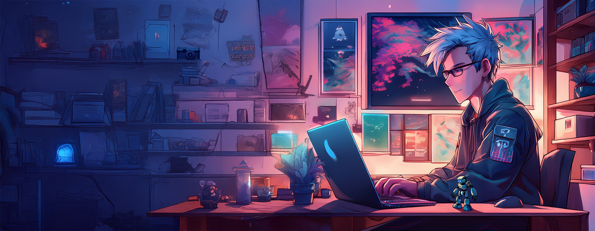

  <h1>:wave: Hey everyone, I'm Emmanuel :wave:</h1>

<!-- Banner -->

  

Hi, I'm a **_French developer_**, who wants to make his life easier with code. When I'm not coding, I enjoy capturing life's moments through photography. I'm also fascinated by robotics engineering and artificial intelligence, which often inspire my projects.
All codes presented here are written in **_C_** or **_Bash_** (perhaps I will use other languages), and aim to simplify my personal and professional life.
 

### Follow me on

  
  
  &#8287;&#8287;

### Some fun facts about me
- I love listening Metal music 🤘🏻🎸. It calms me and allows me to concentrate on my tasks.
- I love Japan 🇯🇵, its landscpes, culture, food and people. I went there twice. The first time is during automn 2017, and it was my first time traveling in an airplane. My second time in Japan was at spring 2023. And it won't be the last, for sure.

#

<!-- Languages and Tools section -->
## 🧰 Languages and Tools

  <!-- C/C++ -->
  
  <!-- Bash -->
       
  <!-- Linux -->
  
  <!-- Debian -->
  
  <!-- Raspberry Pi -->
  
  <!-- Arduino -->
  
  <!-- OpenCV -->
  
  <!-- VSCode -->
  
  <!-- Git -->
  
  <!-- Github -->
  <!--  -->
  

<!-- 

 -->

#

## 📈 Github Stats

  

<!---->

#
